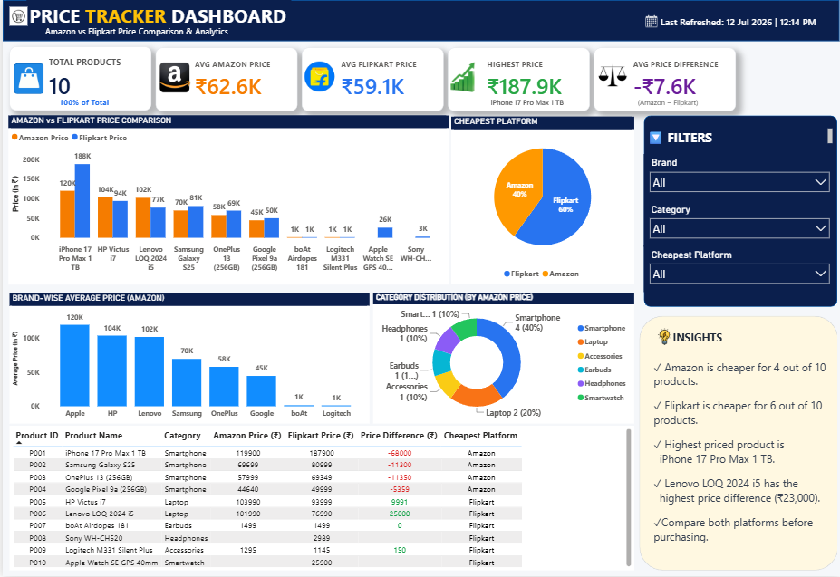

<div align="center">

# 🛒 Price Tracker Dashboard

### 🚀 End-to-End E-Commerce Price Tracking & Analytics System


<br>


<br><br>


</div>

---

# 📖 Project Overview

This project is an **End-to-End E-Commerce Price Tracking System** that automatically collects product prices from **Amazon** and **Flipkart** using **Python + Playwright**, stores and compares the data, maintains historical records, and visualizes business insights using **Power BI**.

The dashboard enables users to compare prices across platforms, identify the cheapest platform, monitor historical changes, and make data-driven purchasing decisions.

---

# 📊 Dashboard Preview

<div align="center">



</div>

---

# ✨ Features

- 🔍 Live Amazon Price Scraping
- 🛒 Live Flipkart Price Scraping
- 📊 Interactive Power BI Dashboard
- 📈 Historical Price Tracking
- 💰 Amazon vs Flipkart Comparison
- 📉 Price Difference Analysis
- 📂 SQLite Database Integration
- 📋 Product Comparison Table
- 🎯 Dynamic Filters
- 📊 KPI Cards
- 📦 Brand-wise Analysis
- 🥧 Category Distribution
- 💡 Business Insights

---

# 🛠 Tech Stack

<p align="center">


</p>

| Technology | Purpose |
|------------|---------|
| Python | Automation & Web Scraping |
| Playwright | Product Price Scraping |
| Pandas | Data Cleaning & Processing |
| SQLite | Data Storage |
| Excel | Product List |
| Power BI | Dashboard & Analytics |
| Git & GitHub | Version Control |

---

# 📂 Project Structure

```text
Price-Tracker/
│
├── dashboard/
│   └── price_tracker_dashboard.pbix
│
├── data/
│   ├── products.xlsx
│   ├── amazon_prices.csv
│   ├── flipkart_prices.csv
│   ├── merged_prices.csv
│   ├── price_history.csv
│   └── price_tracker.db
│
├── scraper/
│   ├── amazon.py
│   ├── flipkart.py
│   ├── database.py
│   ├── history.py
│   ├── price_alert.py
│   └── sql_analysis.py
│
├── screenshots/
│   └── dashboard.png
│
├── logo/
├── run_all.py
├── requirements.txt
├── README.md
└── .gitignore
```

---

# ⚙ Workflow

```text
Products.xlsx
        │
        ▼
Python Web Scraper
(Amazon + Flipkart)
        │
        ▼
CSV Files
        │
        ▼
SQLite Database
        │
        ▼
Merged Dataset
        │
        ▼
Power BI Dashboard
```

---

# 📈 Dashboard KPIs

- 📦 Total Products
- 🛒 Average Amazon Price
- 🛍 Average Flipkart Price
- 💰 Highest Product Price
- 📊 Average Price Difference

---

# 📊 Dashboard Visuals

- Amazon vs Flipkart Price Comparison
- Cheapest Platform Analysis
- Brand-wise Average Price
- Category Distribution
- Product Comparison Table
- Interactive Filters
- Business Insights

---

# ▶️ How to Run

### 1️⃣ Clone Repository

```bash
git clone https://github.com/YOUR_GITHUB_USERNAME/Price-Tracker.git
```

### 2️⃣ Install Dependencies

```bash
pip install -r requirements.txt
```

### 3️⃣ Run Scraper

```bash
python run_all.py
```

### 4️⃣ Update Price History

```bash
python history.py
```

### 5️⃣ Open Power BI Dashboard

```
dashboard/price_tracker_dashboard.pbix
```

### 6️⃣ Refresh Dashboard

```
Home → Refresh
```

---

# 📌 Future Improvements

- 📧 Email Price Alerts
- 📱 Telegram Notifications
- ⏰ Automatic Daily Scheduling
- 🌐 Streamlit Web Application
- ☁ Cloud Deployment
- 🗄 MySQL Integration
- 📈 Historical Trend Analysis
- 📊 Advanced Business Analytics

---

# 👨‍💻 Author

**Saurabh Shivkriti**

📧 saurabhshivkriti1001@gmail.com

💼 Aspiring Data Analyst

🔗 LinkedIn: *(Add your LinkedIn profile)*

🌐 Portfolio: *(Add your portfolio website)*

---

<div align="center">

### ⭐ If you found this project useful, don't forget to Star this Repository ⭐

</div>
